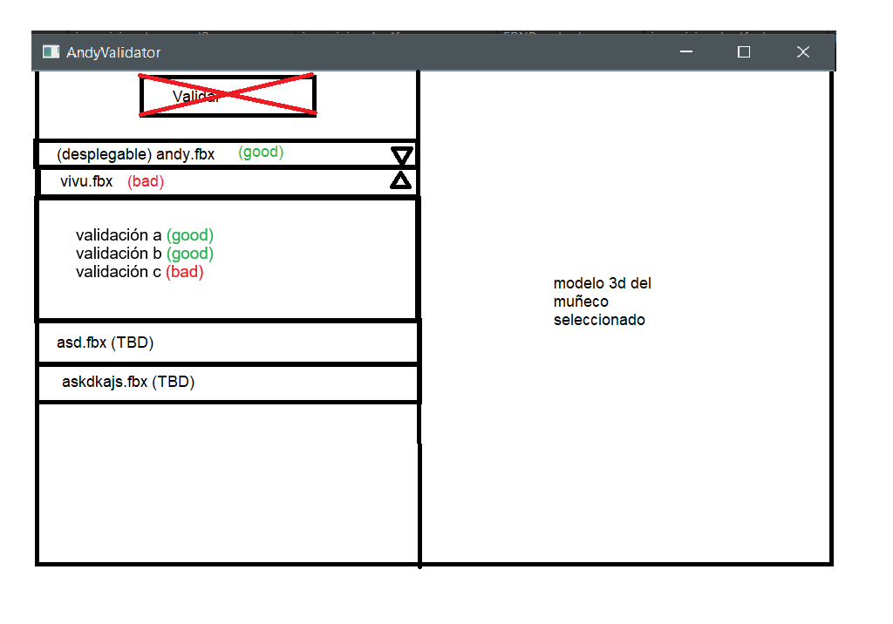
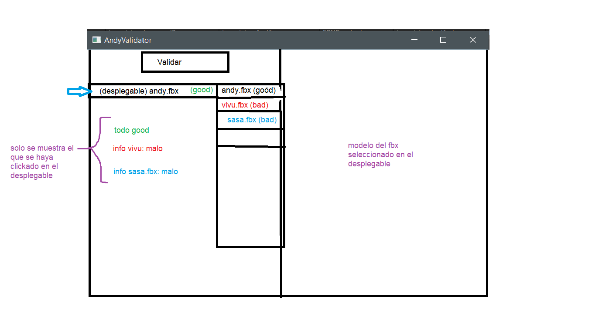
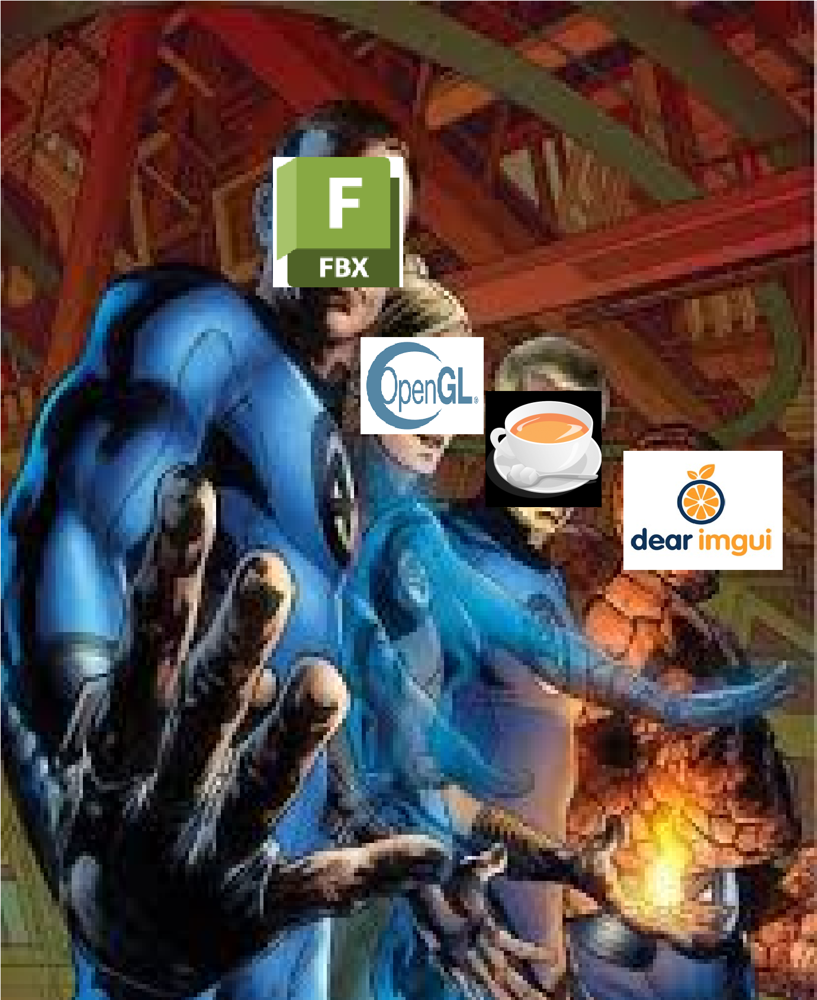

# Andy-Validator
Software de validacion de modelos 3D de formato FBX para videojuegos

## Índice
1. [Instrucciones](#instrucciones)
2. [Concept](#concept-art)
3. [Arquitectura](#arquitectura)
4. [Librerias](#clibrerias)
5. [Terceros](#terceros)

## Instrucciones
### Instalación del FBX SDK
1. Descargar el instalador del sdk versión 2020.3.9 desde [la web oficial](https://aps.autodesk.com/developer/overview/fbx-sdk)
2. Instalarlo en la carpeta dependencies, debería quedar algo como "dependencies/2020.3.9/"  

Recuerdo poner el directorio de trabajo del proyecto principal en $(TargetDir)

## Concept art
**AVISO: HE HABALDO CON GUILLE TENER UN BOTON VALIDAR ES ILEGAL SE HACE TODO NADA MAS ABRIR LA APLICACION. NO HAY BOTON**
### Opcion 1

### Opcion 2

   
## Arquitectura
### Window
Proyecto que gestiona y crea la ventana. Proporciona las herramientas para crear elementos de la UI
### FBX
Proyecto que realiza la validacion a traves del sdk de autodesk. El punto de entrada inicializa la libreria y gestiona el hilo secundario que corre la importacion y validaciones de cada modelo.
#### Validaciones
La clase Validation es virtual y de ella heredara cada tipo de validacion distinta, implementando el metodo validate() segun cada caso
```
class Validation
{
public:
	virtual ~Validation() = default;

	virtual void validate(const FbxScene* fbx, ValidationResults& results) = 0;
};
```
El FbxScene es el modelo, la libreria los llama escenas pero es un unico modelo. Results es un struct que tendrá un booleano por cada validacion. Se pasa por referencia porque cada implementacion de validate() pondrá a true el booleano correspondiente a su validación si el modelo lo cumple (hay un struct por modelo)
```
struct Results
{
	ModelData model; // Para OpenGL
	size_t index; // Para almacenamiento

	// bool validacionX
	// bool validacionY
	// bool validacionZ
	// etc
};
```
El ValidatorManager es el encargado de iterar por cada modelo llamando a todos los validate() de cada uno. Guardará los resultados de la validacion en un vector que leerá el Core para mostrarlos en la ventana. 
```
class ValidatorManager 
{
public:
    ValidatorManager();

    void runValidations(const FbxScene* scene, Results& results) const;

private:
    std::vector<std::unique_ptr<Validation>> _validations;
};
```
#### Importacion
ImportManager importa cada modelo a una FbxScene que luego FBX pasa al ValidatorManager, tras las validaciones el ImportManager traduce los datos del modelo a una estructura que OpenGL pueda entender
```
struct Vertex 
{
    glm::vec3 position;
    glm::vec3 normal;
    glm::vec2 texCoords;
};

struct TextureData 
{
    std::string filePath;
    std::string type;
};

struct MeshData 
{
    std::vector<Vertex> vertexes;
    std::vector<int> indexes;
    std::vector<TextureData> textures;
};

struct ModelData 
{
    std::vector<MeshData> meshes;
};
```
### Core
Proyecto que gestiona la aplicacion y su bucle. Llama al render y lee los modelos que luego FBX carga, gestiona los resultados devueltos por el proyecto FBX para mostrarlos en la ventana.
```
void Application::run()
{
    FBX::instance().start(_loader->getModelPaths()); // Inicia hilo trabajador

    while (!Window::instance().shouldWindowClose())
    {
        const auto results = FBX::instance().checkNewResults();
        for (const auto& result : results)
    	{
            _results[result.index] = result;
        }

        Window::instance().updateWindow();
    }
}
```
Lee de la misma carpeta un archivo validator.cfg que tiene datos dependientes del proyecto específico. El usuario debe cambiarlo segun la necesidad. Si no encunetra el archivo lo crea con valores por defecto
```
struct Config
{
    int polygons = 10000;
    bool unreal = false;
};
```

## Librerias
pum (y glm)



## Terceros
El ejecutable final contiene el SDK de Autodesk® FBX® de forma estática. El uso de este SDK está sujeto a los términos de licencia de Autodesk. Nuestro código interactúa con este SDK pero es independiente de él.


